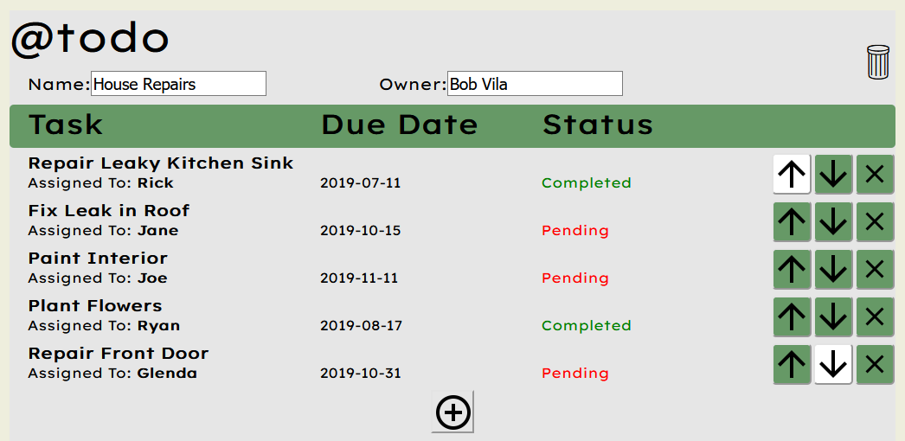
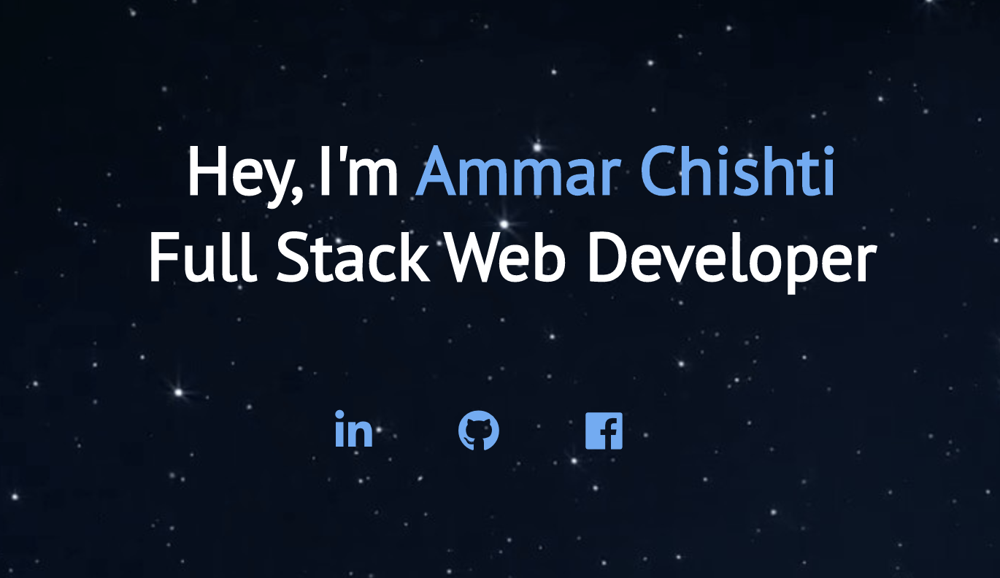

<html>
    

      

        <h3>Todolist Manager Web Application in React</h3>
        
        
          This was a Todolist manager I created for a class project. In addition to its core functionality,
          the project features undo and redo capabilities through the implementation of a
          Transaction Processing System
        
      

      

        <h3> Account Manager Web Application </h3>
            
        
          This was a Front-End web application I created to help me
          keep track of my financial transactions
        
      

       
       
      

        <h3> Bing Rewards Automator (Desktop/IOS) </h3>
        
        
          This was a python script as well as an IOS application I developed to help automate 
          Bing Rewards searches for multiple Microsoft accounts
        
      

       
       
      

        <h3> Personal Website Version 2 </h3>
        
        
          This was a static website I created using HTML, CSS, and JavaScript to help
          sharpen my web development skills 
        
      
 
    

</html>

