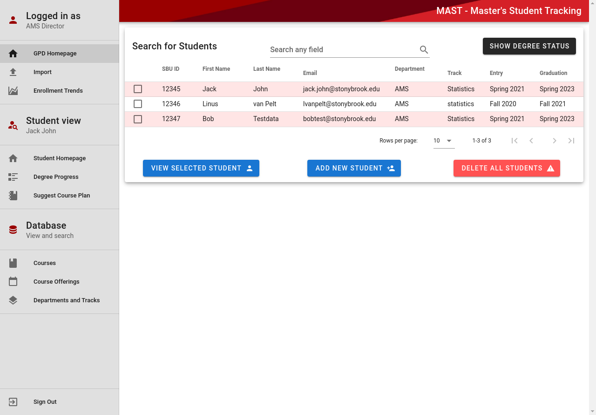

<html>
    

      

        <h3> Bing Rewards Automator (iOS/Desktop) </h3>
        
        
          Developed an iOS app and a desktop Selenium script to automate reward point retrieval and redemption for cash prizes. This project led to a summer iOS internship at Weight Watchers
        
      

      

        <h3>MAster-Student-Tracking</h3>
            
        
         MAST is a full stack web application that helps M.S. students and graduate program directors (GPDs) determine whether students are on track to satisfy degree requirements for their respective major by their planned graduation date
        
      

      

        <h3>Wireframer Web Application</h3>
            
        
         Wireframer is a web application I created using React.js and Firebase that allows registered users to create and save their own wireframes (website mockups)
        
      

      

        <h3>Ammar's First Personal Website</h3>
          
          
            This is my first personal project :D
          
      

    

</html>

